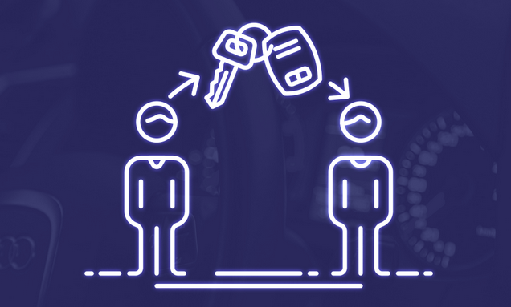

# AutoChain
**A decentralized blockchain for the network for automobile ownership.**

    
     
     

 
There have been lots of cases of robbery, fraud, fake, etc of the vehicles in the automobile industry. Many a time, the stolen vehicle is illegally found in someone’s house with illegal ownership. The core motivation is to reduce the appearance of 3rd party agents for safe and secure transactions. 
The implementation of blockchain makes it easy to check a vehicle’s real history. Once data is entered into a blockchain, it becomes immutable, which means it can’t be changed. This eliminates data tampering and manipulation and dramatically reduces the risk of fraud. Since access to data is tracked, attempts to change data can be traced to the individual trying to make the changes. All of these features create a chain of trust that ensures that vehicle data remains accurate. 
Also, the transfer of vehicle ownership has always been a long, tedious process. It involves filling out multiple paper documents, approval from numerous people, and going through many processes. This not only takes a long time, but also opens up registration to human error, or worse, fraud or manipulation of data. With so many steps in the process, it also costs a lot. Blockchain makes all of this quicker, easier, and safer. 
Blockchain technology is all digital, which means there are no more cumbersome forms to fill out or paper records to search for. All the information is available and easily accessible. Smart contracts allow this information to be authenticated by the relevant people. The data is always available, making ownership transfer on future vehicle purchases even easier. 
The outline here is the demonstration of my idea and the curiosity in blockchain technology. It is a theoretical blockchain, implemented in Python, which is used as the tracking records of vehicle ownership.
